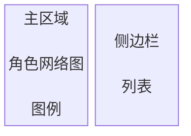
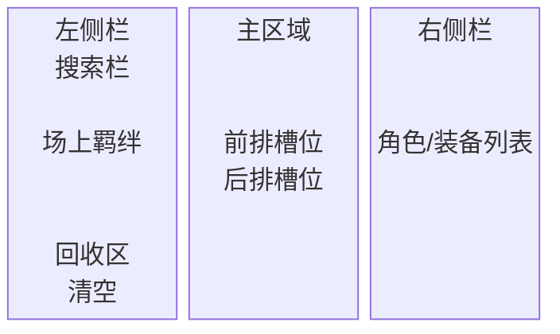

# 角色网络星图 & 阵容摆放 & 图鉴

基于 D3.js 的《崩坏：星穹铁道》货币战争的模拟工具，含角色星图、阵容摆放、环境图鉴、策略图鉴四种模式。

由于技术问题，尚未对移动端进行适配或优化，请务必使用 pc 端浏览器查看，避免在移动端使用。

- **首页**：`index.html` — 欢迎页，提供四种模式的入口
- **主应用**：`app.html` — 角色星图 & 阵容摆放 & 环境图鉴 & 策略图鉴

可通过 `https://pointshine.github.io/HSR_CW_NetWork/` 浏览。

## 设计风格

全站统一星空粒子背景（Canvas）+ 毛玻璃面板（backdrop-filter: blur）。新拟物化风格用于按钮、卡片等交互元素。

## 导航

- **首页**（`index.html`）：星空粒子背景、流光标题、新拟物视差卡片。四张卡片分别进入「角色星图」（`?mode=graph`）、「阵容摆放」（`?mode=team`）、「环境图鉴」（`?mode=environment`）、「策略图鉴」（`?mode=strategy`）
- **主应用**（`app.html`）：顶栏标签在四种模式间切换，切换时地址栏同步更新，刷新页面保持当前模式不变
- **返回首页**：顶栏最右侧 ⌂ 按钮，阵容模式弹出确认框，其余模式直接返回首页

## 模式切换

顶栏标签（胶囊药丸）在四种模式间切换：

- **角色星图**：角色羁绊关系网络图，交互式探索角色之间的关联
- **阵容摆放**：拖拽式角色布阵工具，模拟队伍编排
- **环境图鉴**：环境祝福效果浏览，按分类分组折叠展示
- **策略图鉴**：投资策略效果浏览，按稀有度区分卡片样式

### 界面特色

- **星空背景**：全屏 Canvas 粒子动画，星点呼吸闪烁
- **毛玻璃面板**：侧边栏、阵容面板统一半透明白底 + 高斯模糊
- **胶囊顶栏**：圆角 Tab 按钮，激活态浮起
- **新拟物图例**：左下角图例胶囊容器

---

## 一、角色星图

### 界面



### 功能

- 拖拽、缩放、平移浏览角色网络
- 点击节点查看角色详情（羁绊标签、费用徽章、站位图示）
- 独立羁绊角色金色旋转光环，专家顾问青绿色呼吸光环
- 点击羁绊标签查看羁绊详情，筛选关联角色
- 拖拽节点高亮邻接关系

### 侧边栏（图鉴）

右侧可拖拽调节宽度的面板，含四个子列表：

| 列表 | 内容 |
| :----: | :----: |
| 羁绊列表 | 阵营羁绊 / 流派羁绊 / 独立羁绊分组，支持折叠展开 |
| 专家顾问 | 专家角色及所属羁绊 |
| 费用列表 | 1-5 费及特殊费用分组，支持折叠展开 |
| 站位列表 | 前台 / 后台 / 前后台分组，支持折叠展开 |

- 列表间通过 ` ☰ ` 菜单切换
- **羁绊详情**：点击羁绊展开详情面板（新拟物凹陷框），依次展示介绍、补充说明、层级加成、所属角色列表；点击角色选中并定位节点

---

## 二、环境图鉴

### 内容

- 浏览全部环境祝福（`environment_data.js`），按分类分组展示
- 分组：**特邀专家**、**概念股**、**邀请**、**契约**、**人才**、**佩佩**、**时代**、**经济**、**贵族**、**战斗力**、**其它**（按优先级依次归类，拼音排序，不重复）
- 各组内按拼音首字母排序
- 分组可点击标题收起/展开，毛玻璃卡片网格布局

---

## 三、策略图鉴

### 界面内容

- 浏览全部投资策略（`strategy_data.js`），按分类分组展示
- 数据结构：`名称 → {介绍, 稀有度}`，稀有度分为棱彩、金色、银色
- 分组：**星徽套组**、**星徽**、**祝福**、**专家顾问**、**榜样的力量**、**爆晶矿**、**好运令牌**、**援军** 等 38 个分组 + **其它**
- 分组标签按拼音排序，组内条目按拼音排序
- 卡片样式按稀有度区分：棱彩彩虹渐变动画、金色静态边框、银色灰边框
- 分组可点击标题收起/展开
- 左上角「☰ 筛选」按钮可按稀有度过滤卡片（棱彩 / 金色 / 银色），复选框实时生效

---

## 四、阵容摆放

### 布局



阵容卡牌始终在左右侧栏之间居中，右侧栏不会遮盖卡牌。槽位区域根据底排卡牌数量动态调整最小宽度，底排卡牌不可换行。

### 操作

- **拖拽上场**：从右侧图鉴拖拽角色卡牌到主区域槽位，拖拽时自动解除溢出裁剪
- **互换位置**：槽位间拖拽卡牌，自动与目标位置交换
- **删除卡牌**：拖拽场上卡牌到左下回收区，或点击清空按钮一键清除
- **站位校验**：前台角色放后排或后台角色放前排时，站位方块变红警示
  - **巡海游侠**羁绊成员的前台角色可放于后排，站位方块变绿
  - **不死途**前后台均可，站位方块始终绿色
- **角色互斥**：开拓者·记忆和开拓者·欢愉不可同时上场，一方在场时另一方在图鉴中隐藏
- **开拓者·欢愉/开拓者·记忆变形**：拖入上排自动变开拓者·记忆，拖入下排自动变开拓者·欢愉
- **槽位管理**：初始下排6个槽位，装备**财富宝钻**可增加下排槽位（每个财富宝钻+1，最多叠加+3）

### 搜索

阵容模式左侧面板顶部搜索栏常驻（`search.js`），支持实时模糊匹配角色名/羁绊名/装备名：

- **搜索特性**：

- **输入即搜** — 键入时自动列出所有含搜索词的结果，以下拉列表展示；拼音输入法适配，确认后触发
- **点选结果**：角色/羁绊：场上对应卡牌高亮并排至最前；装备：自动切换装备栏并展开对应分类高亮
- **空白关闭** — 下拉列表消失后显示"未找到"提示
- 清空搜索或手动追踪羁绊后高亮自动清除

### 场上羁绊 & 追踪

- 左侧面板显示场上角色涉及的羁绊，数量格式为 `当前/下一层需求`（达到最高层仅显示数量）
- 最多可同时追踪 **3** 个羁绊，追踪后场上角色及图鉴角色卡牌带有粉色边框高亮
- 羁绊数量达到不同层级时自动变色：铜 → 银 → 金 → 幻彩（由 `__CAMP_COLORS` 驱动）
- 未达最低激活数时数量显示灰色；独立羁绊有角色即金
- 已激活的独立羁绊排至最前，其余已激活羁绊按激活人数降序，未激活羁绊排在最后
- 单击羁绊弹出详情框，包含追踪按钮、羁绊介绍、各层级加成（已激活/未激活区分）、补充说明（角色条目仅在场角色亮起，装备对应星徽时"星徽"条目亮起）；羁绊人数变动时内容实时更新
- **盛会之星·巨星**：盛会之星羁绊激活后（≥2人）自动弹出选择框，从场上盛会之星成员或佩戴盛会之星星徽的角色中挑选一名为**巨星**；层级加成一栏显示该巨星当前层级的专属加成（星徽角色显示星徽加成）；羁绊详情弹窗中可随时点击"更换巨星"重新选择；巨星卡牌带有金色内发光及 ⭐ 标记
- **能量羁绊·能量地块**：能量羁绊激活后（≥3人），前排行首和后排行首的卡牌槽位获得透明玻璃特效（淡蓝渐变 + 蓝色内发光）；能量人数达到满层（10人）时，**所有**卡牌槽位均获得该特效
- **星核猎手·猎星人**：星核猎手羁绊激活后，场上装备最多的成员自动成为**猎星人**（⚔ 标识），卡牌带有红色内发光。
  - **自动选拔**：每次装备变动后重新计算，装备数量最多的星核猎手成员当选
  - **破平规则**：数量相同时优先选最近获得装备的成员，均无装备时按上场顺序
  - **双猎星人**：羁绊人数 ≥ 4 时，猎星人上限提升至 **2 人**
- 已上场角色在图鉴中自动隐藏，互斥对角色同步隐藏

### 右侧面板

- 右侧 flex 面板，与左侧栏和槽位区域同处 flex 流中，不覆盖主区域
- 追踪羁绊时若当前为武器列表，自动切换回角色列表并滚动至顶部
- 通过 ` ☰ ` 菜单在**角色列表**和**装备列表**间切换
- 角色列表：可拖拽的角色卡牌，显示角色名、羁绊标签、费用徽章、站位指示
- 装备列表：按类别分组（简易装备、进阶装备、特权装备等），样式参考图鉴侧边栏羁绊列表，支持折叠展开
- 装备会根据 `__LIMITS` 检查场上羁绊条件：满足条件的装备排前，不满足的字体变灰
- **场上无角色时**，所有装备统一变灰且不可拖拽；角色上场后恢复条件判断
- 拖拽按钮固定在面板左边缘，随面板一起移动
- 拖拽按钮允许自由调整宽度，最小 150px，最大宽度受槽位区域最小宽度约束
- 拖过阈值自动折叠，点击按钮切换折叠/展开（◀ / ▶）
- 折叠时宽度收至 0，按钮仍可见于面板左边缘

### 武器装备

- **装备武器**：从右侧装备列表拖拽武器到场上角色卡牌的武器栏（每张卡牌下方三行槽位），松开后装备
- **装备限制**：每个角色最多装备 3 个武器（`进阶装备`、`特权装备`、`垃圾袋`、`金垃圾袋` 可重复装备）；武器激活条件未满足时不可拖拽
- **星徽效果**：装备星徽时，对应羁绊的人数视为 +1（如装备 `欢愉星徽` → 欢愉羁绊人数 +1）
- **星徽限制**：角色不可装备自身已有羁绊对应的星徽（含已装备星徽赋予的羁绊），合成出受限星徽时结果会被丢弃
- **财富宝钻**：装备后下排槽位 +1，同一角色可装备多个，效果可叠加（最多 +3）
- **`__LIMITS` 武器**：激活条件满足后可以装备，装备后在装备列表中显示"已装备"标签并恢复淡色，不可重复装备
- **移除武器**：拖拽已装备武器到回收区即可删除
- **查看已装备武器**：单击已装备武器弹出信息框（同武器列表），但合成结果可直接点击执行合成

### 武器合成

- **合成检测**：拖拽武器时，自动检测能否与目标角色已有的武器合成（基于 `__MERGE` 配方）
- **合成预览**：可合成时，卡牌上方出现小框仅显示合成结果装备名；多个合成结果并排显示
- **合成执行**：松手后自动完成合成——移除所有原料武器，添加合成结果
- **合成优先**：如果可合成，则只合成而不会单独装备；无法合成时正常装备
- 两个相同的武器也可合成（如 轮滑鞋 + 轮滑鞋 → 反重力皮靴）
- 支持三材料合成（如 垃圾袋 + 垃圾袋 + 垃圾袋 → 金垃圾袋），角色须拥有全部材料

### 武器信息查看

- **单击装备列表中的武器**：如果该武器有相关信息，弹出信息框显示：
  - **基础属性**：来自 `__STATS` 的加成数据（绿色）
  - **描述**：来自 `__STATS` 的技能/效果描述（紫色），支持 `\n` 换行
  - **参与合成**：作为原料可合成的所有配方（A + B → C）
  - **获取方式**：可通过合成获得该武器的所有配方
  - **激活条件**：若在 `__LIMITS` 中，显示激活所需的羁绊条件
  - 弹窗内容超出时自动滚动，不改变弹窗尺寸
- 无相关信息的武器单击无反应
- 再次单击同一武器或单击外部区域关闭信息框
- **已装备武器的信息框**：合成结果均可直接点击，点击后立即执行合成（消耗两种原料武器，生成结果装备）
- 武器被拖拽删除时信息框自动关闭

### 特殊角色

部分阵营羁绊激活后，场上自动召唤对应的特殊角色卡牌。多张卡牌时按拼音排序垂直堆叠，无内容时容器自动隐藏。

- **单击详情**：点击任意特殊角色卡牌弹出对应羁绊的介绍与补充说明，再次点击关闭。

#### 阿哈（欢愉）

- **横置卡牌**：金色边框
- **武器系统**：三个武器栏，初始各随机一件 `简易装备`；每激活一层依次解锁一个栏位
- **顺序合成**：须按栏位顺序合成，前栏合成为 `进阶装备` 后下一栏才可交互；已合成栏位变绿不可再改
- **拖拽合成**：从装备列表拖拽 `简易装备` 到阿哈卡牌即可合成；也可单击栏位弹窗合成
- **层级回退**：欢愉层级降低时超出栏位恢复初始，但保留合成记录
- **特权进化**：欢愉人数 ≥ 7 时，全部 `进阶装备` 自动进化为 `特权装备`

#### 步离人（狼狩）

- **竖置卡牌**：银蓝配色（`#4a6090`）

#### 月色精华（夜之半神）

- **竖置卡牌**：紫银配色（`#5a40a0`）

#### 猫猫糕（银河学者）

- **竖置卡牌**：暖粉配色（`#a06040`）

#### 猎星人

星核猎手羁绊激活后，场上装备最多的成员自动成为**猎星人**（⚔ 标识），卡牌带有红色内发光。

- **自动选拔**：每次装备变动后重新计算，装备数量最多的星核猎手成员当选
- **破平规则**：数量相同时优先选最近获得装备的成员，均无装备时按上场顺序
- **双猎星人**：羁绊人数 ≥ 4 时，猎星人上限提升至 **2 人**

### 角色卡牌

每张卡牌显示：角色名、所属羁绊标签、费用徽章、站位指示、三个武器槽位

### 界面风格

全站采用**星空粒子背景 + 毛玻璃面板**视觉体系：

- **星空背景**：Canvas 星点呼吸动画，全站统一底色
- **毛玻璃面板**：侧边栏、阵容面板半透明白底 + `backdrop-filter: blur`
- **新拟物交互**：按钮、卡片使用双阴影模拟凸起/凹陷质感
- **按压反馈**：`:active` 时从凸起切换为凹陷，模拟物理按动

---

## 文件结构

```bash
├── index.html              # 首页（欢迎页）
├── app.html                # 主应用页面
├── README.md               # 说明文档
├── data/                   # 数据文件
│   ├── camp.js             # 羁绊数据（分类、成员、层级、颜色、内容）
│   ├── chr.js              # 角色数据（专家、费用、站位、介绍）
│   ├── camp.json           # 角色数据 JSON 格式
│   ├── equipments.js       # 装备数据（分类列表、激活条件、合成配方）
│   ├── environment_data.js # 环境祝福数据（名称 → 描述）
│   └── strategy_data.js    # 投资策略数据（名称 → {介绍, 稀有度}）
├── script/                 # 脚本文件
│   ├── landing.js          # 星空背景 + 首页卡片视差（全站共用）
│   ├── graph.js            # 关系图逻辑（含模式切换）
│   ├── team_builder.js     # 阵容摆放主逻辑（槽位渲染、拖放、图鉴、初始化）
│   ├── environment.js      # 环境图鉴逻辑（分组渲染、折叠展开）
│   ├── strategy.js         # 策略图鉴逻辑（分组渲染、稀有度样式）
│   ├── search.js           # 模糊搜索组件（阵容模式）
│   ├── game_state.js       # 共享游戏状态（slotCards, trackedBonds 等）
│   ├── weapon_ui.js        # 武器信息弹窗、合成弹窗
│   ├── aha_mechanics.js    # 阿哈卡牌逻辑
│   ├── buli_mechanics.js   # 步离人卡牌逻辑
│   ├── yese_mechanics.js   # 月色精华卡牌逻辑
│   ├── mmg_mechanics.js    # 猫猫糕卡牌逻辑
│   ├── starhunter_mechanics.js # 猎星人卡牌逻辑
│   └── d3.v7.min.js        # D3.js 库
└── style/                  # 样式文件
    ├── landing.css         # 首页专用样式
    ├── common.css          # 共享样式（含图鉴公共样式 gallery-*）
    ├── graph.css           # 星图模式专用（节点、连线、详情弹窗）
    ├── team.css            # 阵容模式专用（新拟物化 Neumorphism 风格）
    ├── environment.css     # 环境图鉴专用（卡片尺寸、颜色）
    └── strategy.css        # 策略图鉴专用（卡片尺寸、稀有度动画）
```

## 数据说明

### camp.js

- **__CAMP_CLASS**：羁绊分类（阵营羁绊 / 流派羁绊 / 独立羁绊）
- **__CAMP_MEM**：各羁绊的成员列表
- **__CAMP_NUM**：各羁绊每层激活所需角色数量
- **__CAMP_COLORS**：各羁绊每层激活后的高亮颜色（铜/银/金/幻彩）
- **__CAMP_STATS**：羁绊内容（名称、介绍、层级加成、补充说明）

### chr.js

- **__CHR_EXPERTS**：专家顾问角色列表
- **__CHR_SPEND**：角色费用分组（1-5 费、特殊）
- **__CHR_POSITION**：角色站位分组（前台 / 后台 / 前后台）
- **__CHR_INTRO**：角色介绍文本

### camp.json

与 `camp.js` 对应的 JSON 格式数据，含 `camp_class`、`camp_members`、`camp_num`、`camp_colors`、`experts`、`spend`、`position`。

### equipments.js

- **__EQUIPMENTS**：装备分组（简易装备、钻石、垃圾、宝钻、进阶装备、特权装备、羁绊装备、流派星徽、阵营星徽、骇客改件）
- **__LIMITS**：装备激活条件，格式为 `装备名: [["羁绊名", 所需人数], ...]`，场上对应羁绊人数达标时条件满足；该类武器激活后装备不可重复，显示"已装备"标签
- **__MERGE**：装备合成配方，格式为 `结果装备: [["原料A", "原料B"], ...]`
- **__STATS**：装备基础属性，格式为 `装备名: [基础属性:["属性1",...], "描述":"描述"]`

### environment_data.js

- **window.envornment**：环境祝福数据，`名称 → 描述` 的键值对，约 90 条环境

### strategy_data.js

- **window.strategy**：投资策略数据，`名称 → {介绍, 稀有度}`，稀有度分为棱彩、金色、银色
