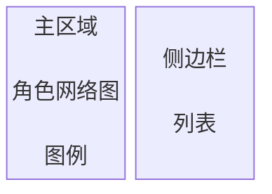

## 角色星图

### 界面

### 功能

- 拖拽、缩放、平移浏览角色网络
- 点击节点查看角色详情（羁绊标签、费用徽章、站位图示）
- 独立羁绊角色金色旋转光环，专家顾问青绿色呼吸光环
- 点击羁绊标签查看羁绊详情，筛选关联角色
- 拖拽节点高亮邻接关系

### 侧边栏

右侧可拖拽调节宽度的面板，含四个子列表：

| 列表 | 内容 |
| :----: | :----: |
| 羁绊列表 | 阵营羁绊 / 流派羁绊 / 独立羁绊分组，支持折叠展开 |
| 专家顾问 | 专家角色及所属羁绊 |
| 费用列表 | 1-5 费及特殊费用分组，支持折叠展开 |
| 站位列表 | 前台 / 后台 / 前后台分组，支持折叠展开 |

- 列表间通过 ` ☰ ` 菜单切换
- **羁绊详情**：点击羁绊展开详情面板（新拟物凹陷框），依次展示介绍、补充说明、层级加成、所属角色列表；点击角色选中并定位节点
- 侧边栏表头样式与阵容摆放右侧栏统一（紧凑排版 + `--text-secondary` 配色）
